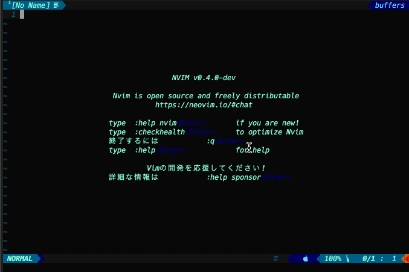

# Tweet.vim

This plugin can tweet from Vim and Neovim

## Requirement

- [webapi-vim](https://github.com/mattn/webapi-vim)

- [open-browser.vim](https://github.com/tyru/open-browser.vim)

## Installtion

If you use [dein.vim](https://github.com/Shougo/dein.vim)

```viml
call dein#add('tyru/open-browser.vim')
call dein#add('mattn/webapi-vim')
call dein#add('kazukazuinaina/Tweet.vim')
```

If you use [Vim-plug](https://github.com/junegunn/vim-plug)

```viml
Plug 'tyru/open-browser.vim'
Plug 'mattn/webapi-vim'
Plug 'kazukazuinaina/Tweet.vim'
```


## Usage

**This plugin have five functions.**

- TweetEdit
- Tweet
- Look User's tweet
- Retweet
- Favo

**If you want to write sentence to do tweet, do below's command.**

```
:TweetEdit
```

**You want to do tweet, you run below command.**

```
:Tweet
```


You want to look user's tweet and tweet id, input user's screen name after below's command running.

```
:TweetLook
```



You want to do retweet, you run below command and input tweet id.

```
:RT
```

You want to do favorite, you run below command and input tweet id.

```
:Favo
```

**If you feel to spicy to write tweet id, you can copy and paste!**

Please run this command after yank tweet id.

```
<C-R>"
```
